# Dokumentacja projektowa 
 
### Aplikacja wykorzystująca mechanizmy rozpoznawania obrazów.
 
# Spis treści

1. [Cel projektu](#cel-projektu)
2. [Opis projektu](#opis-projektu)
3. [Przykłady użycia aplikacji](#przykłady-użycia-aplikacji)
	- [Wybranie obrazu z galerii](#wybranie-obrazu-z-galerii)
	- [Wykonanie zdjęcia](#wykonanie-zdjęcia)
4. [Kod aplikacji](#kod-aplikacji)
	- [MainActivity.java](#mainactivityjava)
	- [AppSingleton.java](#appsingletonjava)
	- [Wikipedia.java](#wikipediajava)	
4. [Autorzy projektu](#autorzy-projektu)
5. [Licencja](#licencja)

# Cel projektu
Celem realizowanego projektu było stworzenie aplikacji wykorzystującej mechanizmy rozpoznawania obrazów oraz wyświetlenie opisu rozpoznanego obrazu. Mechanizmy zostały wykorzystane, do rozpoznawania m.in. wizerunków zwierząt.

# Opis projektu
Animal Finder to aplikacja wykorzystująca mechanizmy rozpoznawania obrazów. Jej zadaniem jest rozpoznanie obrazu oraz wyświetlenie opisu obrazu. Aplikacja została napisana za pomocą oprogramowania Android Studio wykorzystując platformę Firebase do tworzenia aplikacji mobilnych oraz ML Kit dla deweloperów - framework nauczania maszynowego(machine learning).

# Przykłady użycia aplikacji
Po uruchomieniu aplikacji przechodzimy do głównej aktywności, w której zostały umieszczone przyciski nawigacyjne, pozwalające na interakcję z aplikacją oraz pole tekstowe służące do wyświetlania wyników predykcji

 

  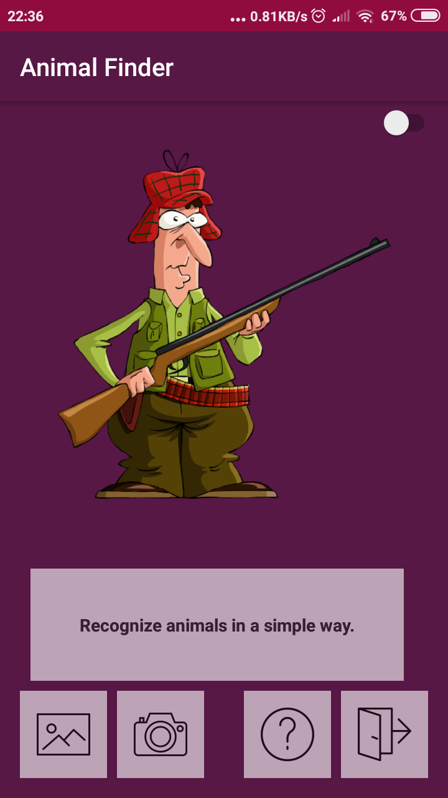
  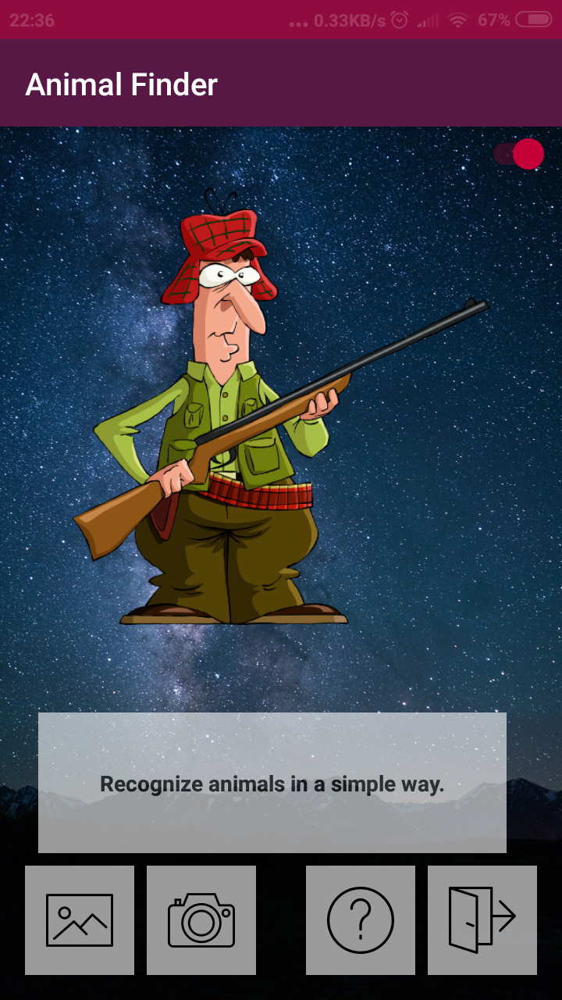

 
 

- Przycisk <strong>galerii</strong>
  - pozwala na import obrazu z pamięci wewnętrznej telefonu
- Przycisk <strong>kamery</strong>
  - pozwala na zrobienie zdjęcia korzystając z aparatu w telefonie
- Przycisk <strong>informacji</strong>
  - pozwala na wyświetlenie opisu obrazu
- Przycisk <strong>zamykania aplikacji</strong>
  - pozwala na zamknięcie aplikacji
- Przycisk <strong>zmiany tła</strong> (switch prawy górny róg)
  - pozwala na zmianę tła w aplikacji

### Wybranie obrazu z galerii
- Wybieramy <strong>przycisk galerii</strong>, a następnie dokonujemy wyboru interesującego nas obrazu

 

  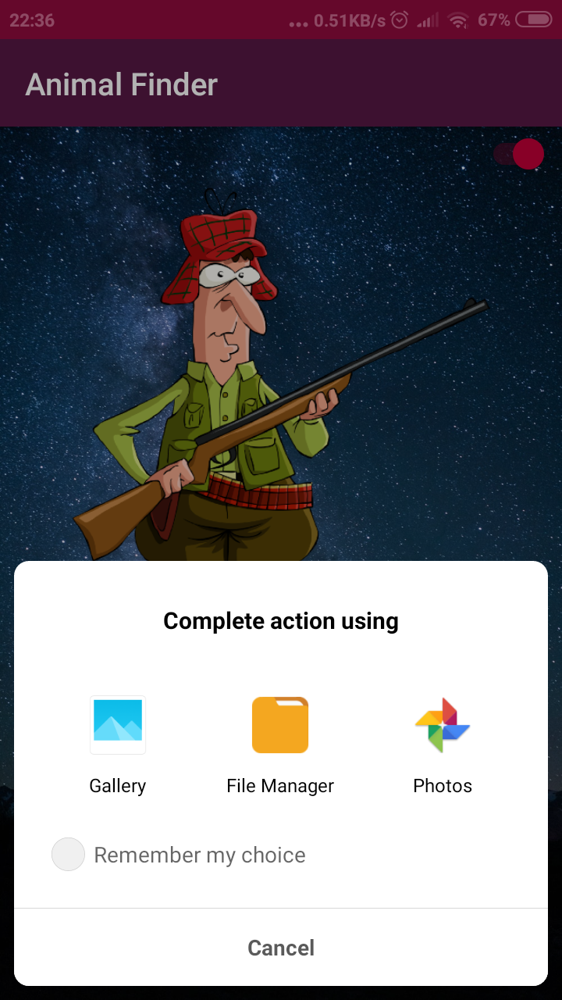 

 

- Na ekranie możemy zaobserwować wybrany przez nas <strong>obraz</strong> oraz <strong>wyniki</strong> predykcji dla rozpoznawanego przez nas obrazu. Wyniki posortowane są od najbardziej prawdopodobnych. Każdy wynik składa się z <strong>etykiety</strong> oraz przypisanej do niej <strong>wartości</strong> 
z przedziału <strong>0.000 - 1.000</strong> oznaczającej prawdopodobieństwo trafności wyniku.

 

  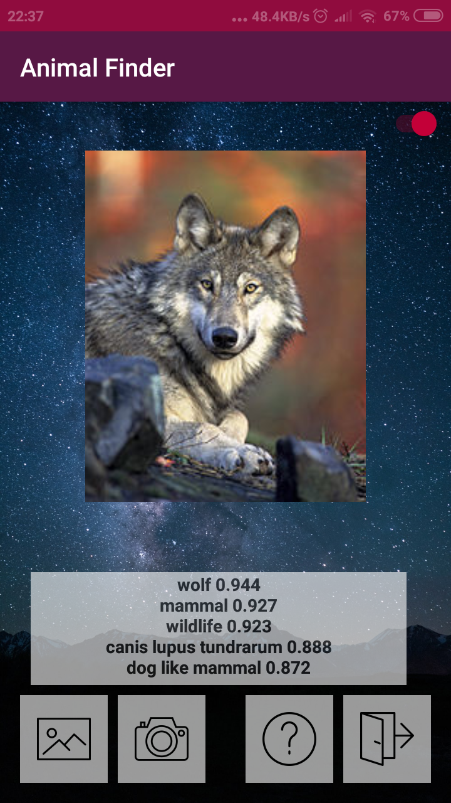 

 

- Wybieramy <strong>przycisk informacji</strong> - aplikacja przenosi nas do nowego widoku w którym znajduję się <strong>opis</strong> szukanego <strong>zwierzęcia</strong> dla najbardziej prawdopodobnego wyniku pobranego ze strony <strong>wikipedia.org</strong>

 

  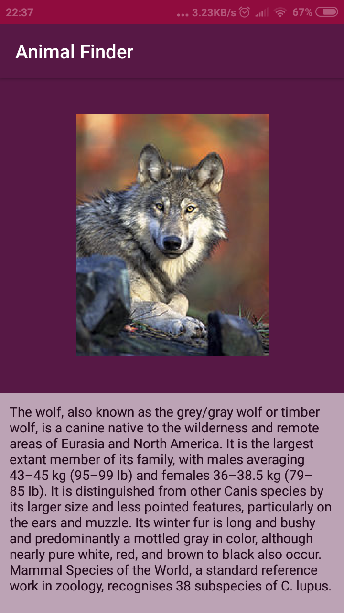 

 

### Wykonanie zdjęcia
- Wybieramy <strong>przycisk zrób zdjęcie</strong> - aplikacja pozwala nam na <strong>wykonanie</strong> zdjęcia wykorzystując nasz <strong>aparat</strong> w telefonie. Na screenie możemy zaobserwować zrobione przez nas <strong>zdjęcie.</strong>

 

  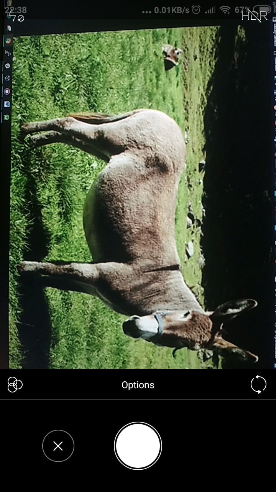 

 

- Na ekranie możemy zaobserwować wybrany przez nas </trong>obraz</strong> oraz <strong>wyniki</strong> predykcji dla rozpoznawanego przez nas obrazu. Wyniki posortowane są od najbardziej prawdopodobnych. Każdy wynik składa się z <strong>etykiety</strong> oraz przypisanej do niej <strong>wartości</strong>
z przedziału <strong>0.000 - 1.000</strong> oznaczającej prawdopodobieństwo trafności wyniku.

 

  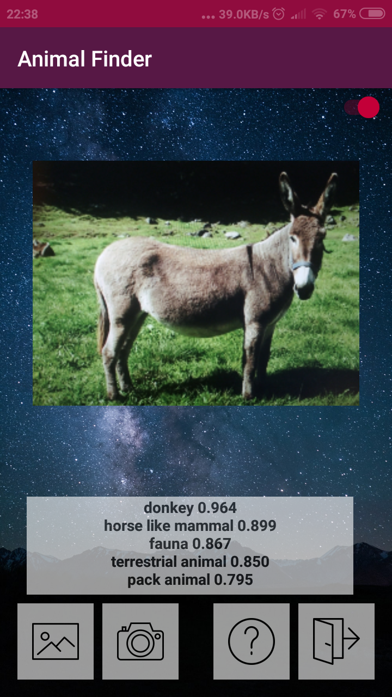 

 

- Wybieramy <strong>przycisk informacji</strong> - aplikacja przenosi nas do nowego widoku w którym znajduję się <strong>opis</strong> szukanego <strong>zwierzęcia</strong> dla najbardziej prawdopodobnego wyniku pobranego ze strony <strong>wikipedia.org</strong>

 

  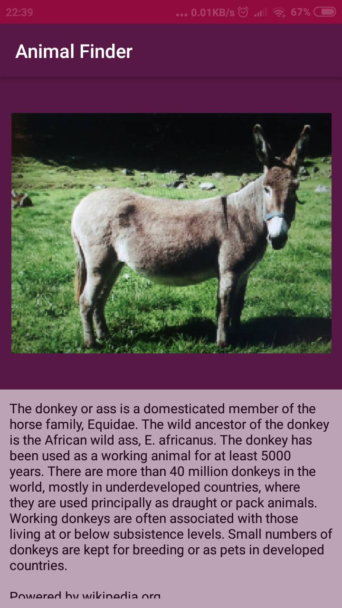 

 

# Kod aplikacji
Stworzona przez nas aplikacja posiada dwa główne widoki <strong>activity_main.xml</strong>(domyślny widok po uruchomieniu aplikacji) oraz <strong>activity_wikipedia.xml</strong>(widok odpowiedzialny za wyświetlanie opisu zwierzęcia). Klasy obsługujące aplikacje to <strong>AppSingleton.java, Wikipedia.java, MainActivity.java.<strong>

### MainActivity.java
Klasa odpowiada za przechwycenie zdjęcia od użytkownika, zmianę jego rozmiaru oraz jego rozpoznanie.
- <strong>Przechwycenie zdjęcia użytkownika</strong>
Realizowane jest w funkcji <strong>onActivityResult()</strong>. Przechwycony obraz konwertowany jest na <strong>BitMapę</strong>, która później wykorzystywana jest do utworzenia obiektu typu <strong>FirebaseVisionImage</strong>. Obraz przechowywany 
w takim obiekcie wymagany jest przez detektor znajdujący się chmurze Google pozwalający na rozpoznanie obrazu.

 

  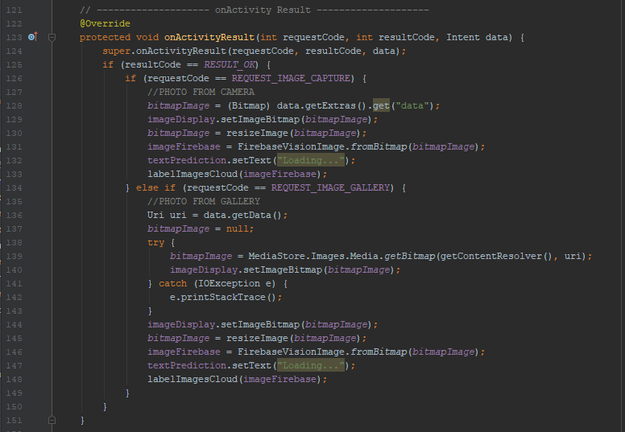 

 

- <strong>Zmiana rozmiaru zdjęcia</strong>
Realizowana jest w funkcji <strong>resizeImage()</strong>. Funkcja jest wykorzystywana, aby uniknąć problemu z przepełnieniem buforu podczas przekazywania go do aktywności <strong>wikipedia</strong>. Obraz zmniejszany jest wraz 
z zachowaniem jego proporcji. Najpierw ustalamy współczynnik proporcji, 
a następnie skalujemy go przy użyciu metody <strong>createScaledBitmap().</strong>

 

  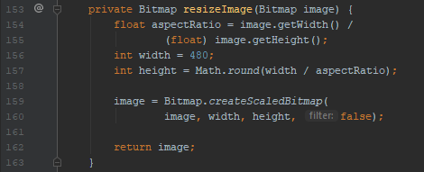 

 

- <strong>Rozpoznanie obrazu</strong>
Realizowane jest w funkcji <strong>labelImagesCloud()</strong>. Funkcja przyjmuje jako parametr obiekt typu <strong>FirebaseVisionImage</strong>, który przechowuje wybrane przez nas zdjęcie. Najpierw tworzymy opcje konfiguracyjne etykiet obrazu wykorzystywane przez nasz detektor tj. wykorzystywany model do rozpoznawania obrazów oraz ilość wygenerowanych wyników predykcji. Następnie tworzymy instancję klasy <strong>FirebaseVisionCloudLabelDetector</strong> zawierającą nasze ustawienia konfiguracyjne. Kolejny krok to utworzenie <strong>Task</strong>, pozwalającego na wykonanie zadania przez naszą aplikację, główna aktywność naszej aplikacji pojawia się w stosie na pierwszym miejscu. Wewnątrz zadania uruchamiany jest nasz <strong>detektor</strong>, który po pomyślnym rozpoznaniu obrazu wypisuje wyniki predykcji wraz z ich nazwami w naszym <strong>textArea</strong>(textPrediction). W przypadku niepowodzenia(błąd połączenia 
z API) wyświetlany jest komunikat o błędzie.

 

  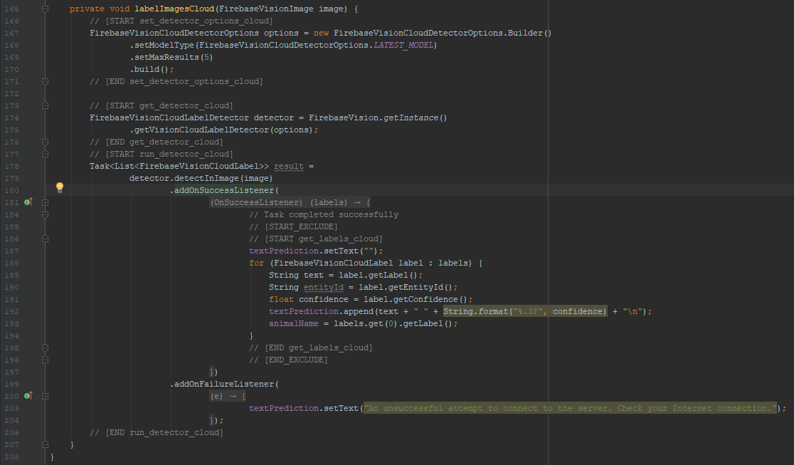 

 

### AppSingleton.java
Klasa wykorzystująca bibliotekę <strong>volley</strong> - która odpowiada za wszystko co ma związek z żądaniami sieciowymi w androidzie. Automatycznie planuje zadania takie jak np. pobieranie odpowiedzi z sieci, zapewnia ona przezroczyste buforowanie pamięci. Wykorzystujemy ją do pobrania obiektu json w klasie <strong>Wikipedia.java</strong>
Nazwaliśmy ją Singleton ponieważ pozwala na utworzenie tylko jednej instancji i uzyskaniu dostępu do tej utworzonej.

### Wikipedia.java
Klasa odpowiadająca za pobranie informacji o zwierzęciu przekazanego z <strong>MainActivity</strong>. Informacje pobieramy w formacie json dzięki api dostępnego na wikipedia.org, a następnie wyciągamy opis z obiektu json w postaci tekstu i wyświetlamy go w naszej aktywności.
Realizowane jest to wykorzystując <strong>AppSingleton</strong> - pobieramy jej instancje i dodajemy do kolejki żądań wcześniej utworzony obiekt <strong>jsonObjectReq</strong>, w którym jako parametr podajemy adres url i oczekujemy 
w nim na odpowiedź od api wikipedii. Jest tu realizowana obsługa błędów 
w przypadku gdy nie będzie informacji o szukanym zwierzęciu lub nie będziemy mieć połączenia z internetem. W pomyślnym przypadku pobrania informacji w formacie json, za pomocą <strong>response.getString("extract")</strong> pobieramy tekst z etykiety extract, w którym znajduję się nasz pożądany opis. Następnie wyświetlamy go w rozwijanym polu tekstowym.

 

   

 

### Autorzy projektu
- Paweł Fiołek
- Alan Biały

### Licencja
- MIT licence
